# Automation Hub

**목차**
1. []()<br>
2. []()<br>
3. []()<br>
4. []()<br>
<br>
<br>

## 1. Automation Hub의 메뉴

### 1.1 네임스페이스 메뉴

#### 1.1.1 메뉴에서 네임스페이스 클릭

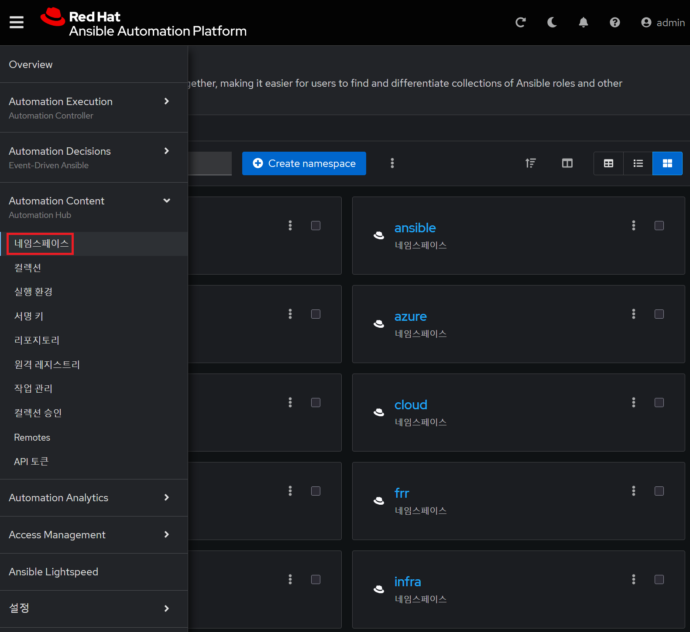

#### 1.1.2 **redhat** 선택

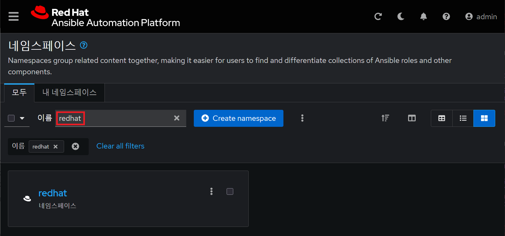

#### 1.1.3 **redhat** 네임스페이스 상의 컬렉션

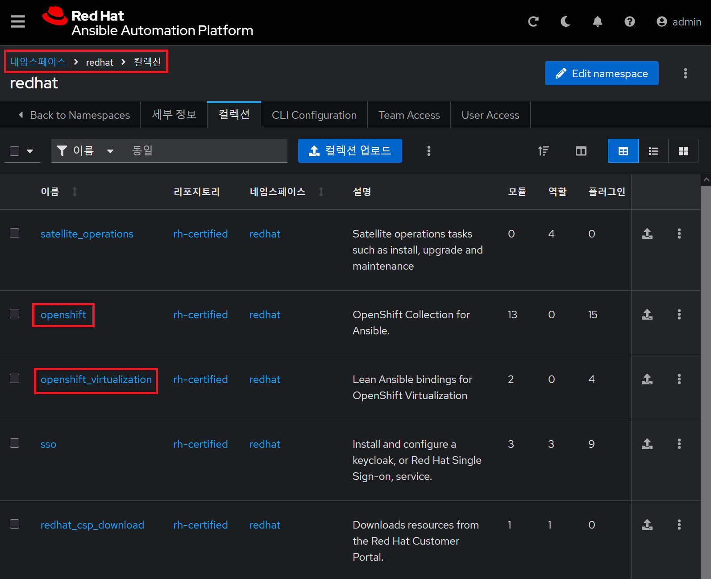
<br>

### 1.2 컬렉션 메뉴

#### 1.2.1 메뉴에서 컬렉션 클릭

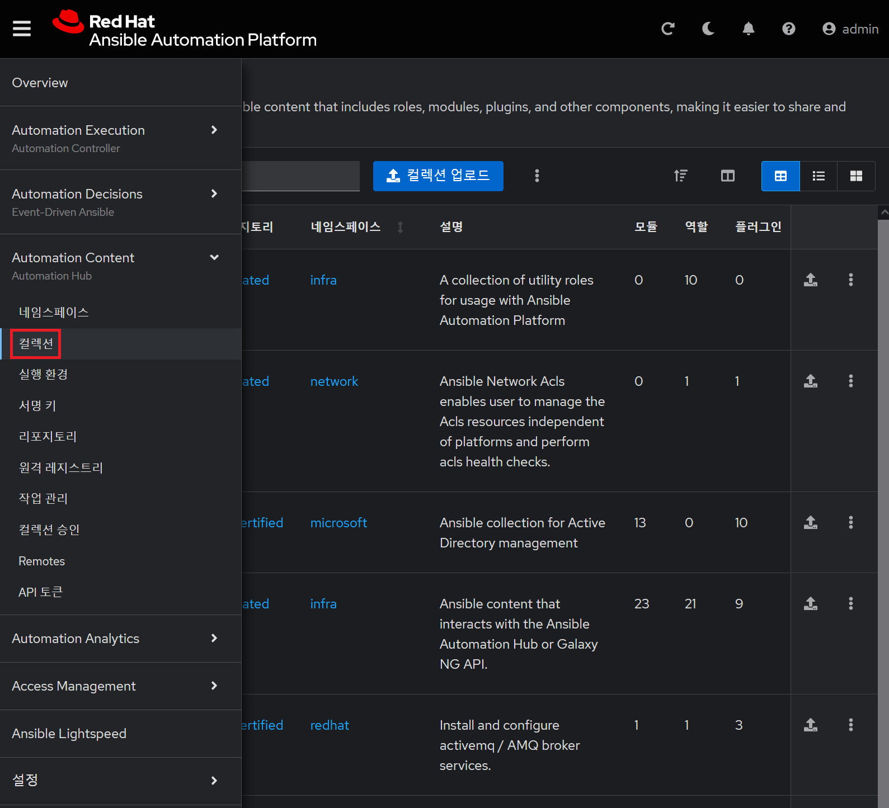

#### 1.2.2 **openshift** 컬렉션

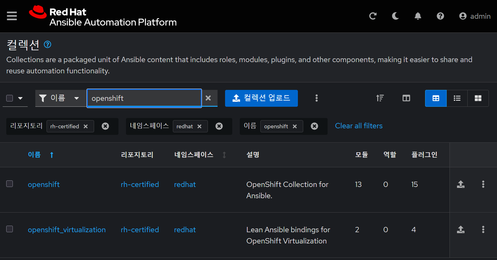

#### 1.2.3 **openshift_virtualization** 컬렉션 콘텐츠

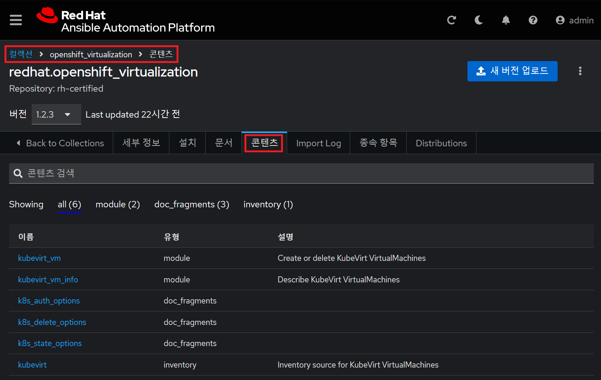

#### 1.2.4 **openshift_virtualization** 컬렉션의 설치

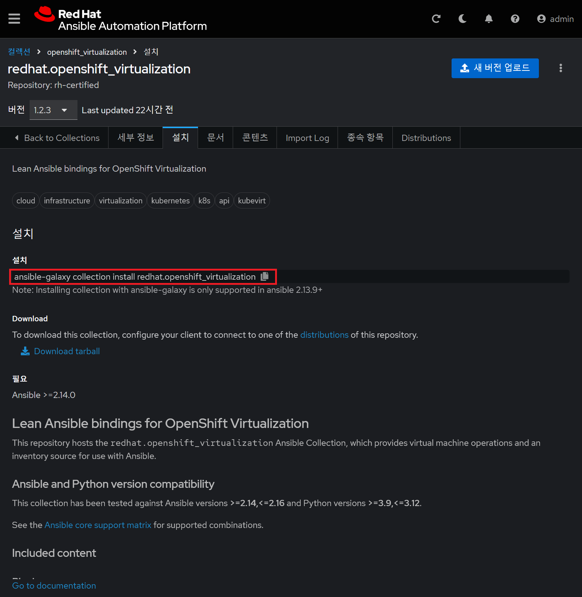

* 컬렉션 설치 방법을 제공
* CLI 기반 설치
  ```bash
  ansible-galaxy collection install redhat.openshift_virtualization
  ```

#### 1.2.5 **openshift_virtualization** 컬렉션 배포

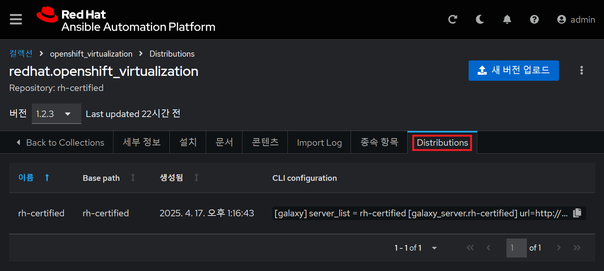

* **CLI configuratin**에서 구성 방안 제공
  + `url`로 제공되는 기본 값은 ***http://localhost:5001***
  + `token`은 **API 토큰** 메뉴에서 확인
* ***ansible.cfg***에 구성 
  ```conf
  [galaxy]
  server_list = rh-certified
  
  [galaxy_server.rh-certified]
  url=http://localhost:5001/api/galaxy/content/rh-certified/
  token=<put your token here>
  ```
  + `url`의 호스트 IP 및 PORT를 실제 서비스 중인 값으로 대체
    - 예: *https://192.168.0.43*
<br>

### 1.3 API 토큰 메뉴

#### 1.3.1 메뉴에서 **API 토큰** 클릭

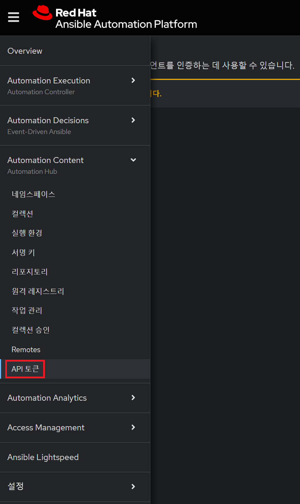

#### 1.3.2 API 토큰에서 토큰 생성

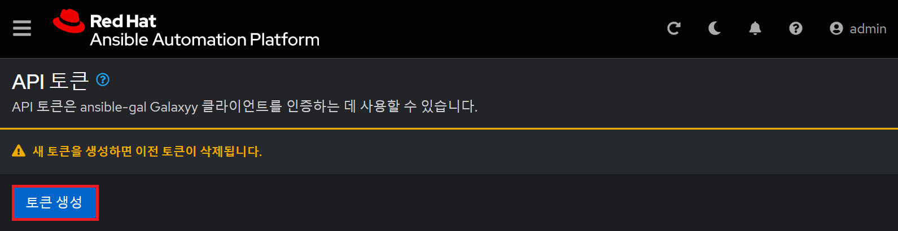

#### 1.3.3 생성된 토큰 복사

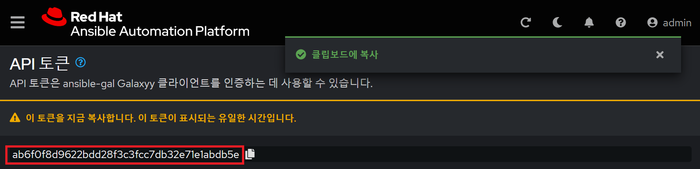

<br>

### 1.4 허브로부터 컬렉션 설치

#### 1.4.1 ***ansible.cfg*** 설정

실행 명령어
```bash
cat ansible.cfg
```

실행 결과
```
[shadowman@aap-c ansible]$ cat ansible.cfg
[defaults]
remote_user=root
inventory=/redhat/ansible/inventory/hosts
log_path=/redhat/ansible/logs/ansible.log
roles_path=/redhat/ansible/roles:/usr/share/ansible/roles:/etc/ansible/roles
collections_path=/redhat/ansible/collections:/usr/share/ansible/collections
host_key_checking=false

[galaxy]
server_list = rh-certified

[galaxy_server.rh-certified]
url=https://192.168.0.43/api/galaxy/content/rh-certified/
token=ab6f0f8d9622bdd28f3c3fcc7db32e71e1abdb5e

[shadowman@aap-c ansible]$
```
* *`url`*의 값은 실제 서비스 중인 호스트에 URI를 *https://<host>/api/content/<repository>/*
* *`token`* 값은 **API 토큰**에서 생성된 토큰을 복사해 붙여 넣기

#### 1.4.2 오픈시프트 가상화 설치

실행 명령어
```bash
ansible-galaxy collection install redhat.openshift_virtualization
```

실행 결과
```
[shadowman@aap-c ansible]$ ansible-galaxy collection install redhat.openshift_virtualization
Starting galaxy collection install process
Process install dependency map
Starting collection install process
Downloading https://192.168.0.43/api/galaxy/v3/plugin/ansible/content/rh-certified/collections/artifacts/redhat-openshift_virtualization-1.2.3.tar.gz to /home/shadowman/.ansible/tmp/ansible-local-235672fiqv46sw/tmp3paw5qvi/redhat-openshift_virtualization-1.2.3-r8_yeysg
Downloading https://192.168.0.43/api/galaxy/v3/plugin/ansible/content/rh-certified/collections/artifacts/kubernetes-core-5.1.0.tar.gz to /home/shadowman/.ansible/tmp/ansible-local-235672fiqv46sw/tmp3paw5qvi/kubernetes-core-5.1.0-7fuwb32q
Installing 'redhat.openshift_virtualization:1.2.3' to '/redhat/ansible/collections/ansible_collections/redhat/openshift_virtualization'
redhat.openshift_virtualization:1.2.3 was installed successfully
Installing 'kubernetes.core:5.1.0' to '/redhat/ansible/collections/ansible_collections/kubernetes/core'
kubernetes.core:5.1.0 was installed successfully

[shadowman@aap-c ansible]$
```
<br>

### 1.5 설치 에러

#### 1.5.1 오픈시프트 가상화 컬렉션 설치 에러

예1 - SSL 인증서 에러
```
[shadowman@aap-c ansible]$ ansible-galaxy collection install redhat.openshift_virtualization
Starting galaxy collection install process
Process install dependency map
[WARNING]: Skipping Galaxy server https://192.168.0.43/api/galaxy/content/rh-certified/. Got
an unexpected error when getting available versions of collection
redhat.openshift_virtualization: Unknown error when attempting to call Galaxy at
'https://192.168.0.43/api/galaxy/content/rh-certified/api': <urlopen error [SSL:
CERTIFICATE_VERIFY_FAILED] certificate verify failed: unable to get local issuer certificate
(_ssl.c:1129)>. <urlopen error [SSL: CERTIFICATE_VERIFY_FAILED] certificate verify failed:
unable to get local issuer certificate (_ssl.c:1129)>
ERROR! Unknown error when attempting to call Galaxy at 'https://192.168.0.43/api/galaxy/content/rh-certified/api': <urlopen error [SSL: CERTIFICATE_VERIFY_FAILED] certificate verify failed: unable to get local issuer certificate (_ssl.c:1129)>. <urlopen error [SSL: CERTIFICATE_VERIFY_FAILED] certificate verify failed: unable to get local issuer certificate (_ssl.c:1129)>

[shadowman@aap-c ansible]$
```
* *self-signed* 인증서 때문에 생긴 이슈로 인증서 등록이 필요

솔루션
```bash
sudo dnf install -y ca-certificates
sudo cp ~/aap/tls/ca.cert /etc/pki/ca-trust/source/anchors/
sudo update-ca-trust extract
```

실행 결과
```
[shadowman@aap-c ~]$ sudo dnf install -y ca-certificates
...<snip>...

[shadowman@aap-c ~]$ sudo cp ~/aap/tls/ca.cert /etc/pki/ca-trust/source/anchors/

[shadowman@aap-c ~]$ sudo update-ca-trust extract

[shadowman@aap-c ~]$
```
<br>
<br>

## 2. Automation Hub의 API

### 2.1 기본 API

#### 2.4.1 AAP의 API 확인

API의 URL
```
https://<host>/api
```

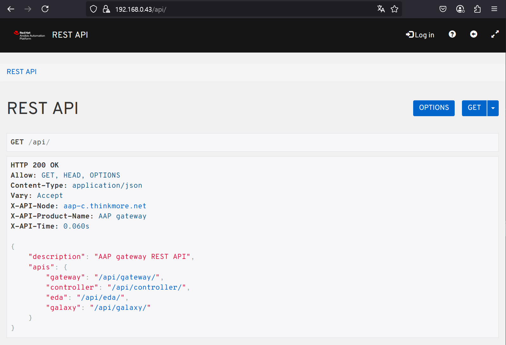

* *gateway*의 API URL: `https://192.168.0.43/api/gateway`
* *controller*의 API URL: `https://192.168.0.43/api/controller`
* *eda*의 API URL: `https://192.168.0.43/api/eda`
* *galaxy*의 API URL: `https://192.168.0.43/api/galaxy`

#### 2.4.2 허브의 API 확인

API의 URL
```
https://<host>/api/galaxy
```

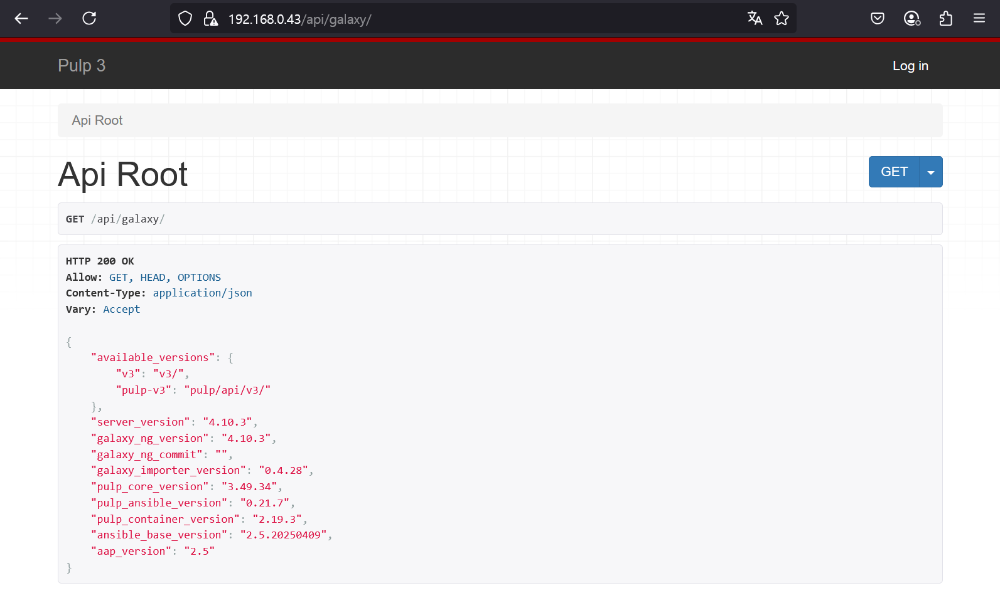

#### 2.4.3 리포지토리의 API 확인

API의 URL
```
https://<host>/api/galaxy/content/<repository>/
```

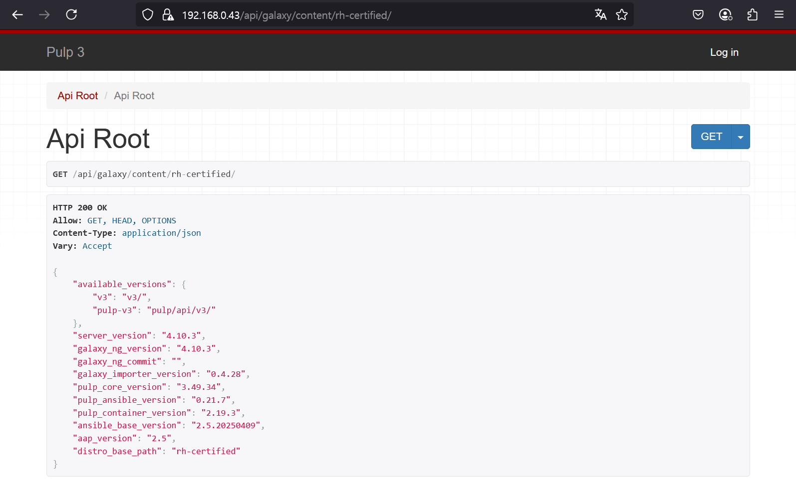

<br>
<br>

------
[차례](../README.md)