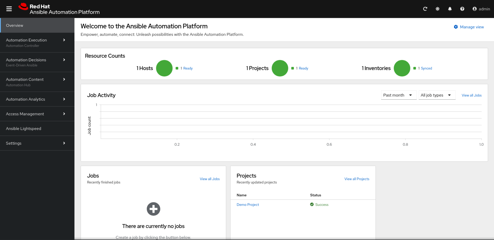

# 로컬에 All-In-One 설치

## 1. 인벤토리 파일 구성

### 1.1 all-in-one 설치를 위한 인벤토리 파일

all-in-one 설치를 위한 인벤토리 파일
```ini
[automationgateway]
aap-c.thinkmore.net ansible_connection=local

[automationcontroller]
aap-c.thinkmore.net ansible_connection=local

[automationhub]
aap-c.thinkmore.net ansible_connection=local

[automationeda]
aap-c.thinkmore.net ansible_connection=local

[database]
aap-c.thinkmore.net ansible_connection=local

[all:vars]
postgresql_admin_username=postgres
postgresql_admin_password=redhat
bundle_install=true
bundle_dir=/home/shadowman/temp/ansible_setup/bundle
redis_mode=standalone
gateway_admin_password=redhat
gateway_pg_host=aap-c.thinkmore.net
gateway_pg_password=redhat
controller_admin_password=redhat
controller_pg_host=aap-c.thinkmore.net
controller_pg_password=redhat
hub_admin_password=redhat
hub_pg_host=aap-c.thinkmore.net
hub_pg_password=redhat
eda_admin_password=redhat
eda_pg_host=aap-c.thinkmore.net
eda_pg_password=redhat
```
* *bundle_dir*의 값은 절대 경로로 입력해야 함
* *redis_mode*는 ***standalone***으로 설정

인벤토리 파일 확인
```bash
egrep -v "^#|^$" inventory
```

실행 결과
```
[shadowman@aap-c ansible-setup]$ egrep -v "^#|^$" inventory
[automationgateway]
aap-c.thinkmore.net ansible_connection=local
[automationcontroller]
aap-c.thinkmore.net ansible_connection=local
[automationhub]
aap-c.thinkmore.net ansible_connection=local
[automationeda]
aap-c.thinkmore.net ansible_connection=local
[database]
aap-c.thinkmore.net ansible_connection=local
[all:vars]
postgresql_admin_username=postgres
postgresql_admin_password=redhat
bundle_install=true
bundle_dir=/home/shadowman/temp/ansible_setup/bundle
redis_mode=standalone
gateway_admin_password=redhat
gateway_pg_host=aap-c.thinkmore.net
gateway_pg_password=redhat
controller_admin_password=redhat
controller_pg_host=aap-c.thinkmore.net
controller_pg_password=redhat
hub_admin_password=redhat
hub_pg_host=aap-c.thinkmore.net
hub_pg_password=redhat
eda_admin_password=redhat
eda_pg_host=aap-c.thinkmore.net
eda_pg_password=redhat

[shadowman@aap-c ansible-setup]$
```
<br>

### 1.2 설치 파일 확인

#### 번들 설치

번들 설치 시, *bundle_dir* 변수에 입력 값을 기반으로 확인

~/collections/ansible_collections/ansible/containerized_installer/roles/preflight/tasks/main.yml
```yaml
#...<snip>...

- name: Include bundle checks
  when: bundle_install | default(false) | bool
  block:
    - name: Ensure bundle_dir is provided
      ansible.builtin.assert:
        that:
          - bundle_dir is defined
          - bundle_dir | length
        fail_msg: 'bundle_dir must be set when bundle_install=true'

    - name: Check the images directory
      ansible.builtin.stat:
        path: '{{ bundle_dir }}/images'
      register: _bundle_images

    - name: Ensure the images directory exists
      ansible.builtin.assert:
        that:
          - _bundle_images.stat.exists | bool
          - _bundle_images.stat.isdir | bool
        fail_msg: 'The bundle directory must contain an images directory'
...
```

#### redis 모드

설치 시, *redis_mode*에서 모드 설정

~/collections/ansible_collections/ansible/containerized_installer/roles/preflight/tasks/redis.yml
```yaml
---
- name: Ensure redis mode is a valid choice
  ansible.builtin.assert:
    that:
      - redis_mode in ['cluster', 'standalone']
    fail_msg: 'Invalid redis mode value.'
  when: redis_mode is defined

- name: Ensure redis cluster is correctly configured
  ansible.builtin.assert:
    that:
      - groups.get('redis', []) | length >= 6
    fail_msg: 'A [redis] group with at least 6 nodes if required for redis cluster mode'
  when: redis_mode | default('cluster') == 'cluster'
...
```
<br>
<br>

## 2. 앤서블 설치

```bash
ansible-playbook -i inventory ansible.containerized_installer.install
```

실행 결과
```
[shadowman@aap-c ansible-setup]$ ansible-playbook -i inventory ansible.containerized_installer.install

...<snip>...

PLAY RECAP **********************************************************************************************************************************************************
aap-c.thinkmore.net        : ok=603  changed=219  unreachable=0    failed=0    skipped=146  rescued=0    ignored=0   
localhost                  : ok=25   changed=0    unreachable=0    failed=0    skipped=38   rescued=0    ignored=0   

[shadowman@aap-c ansible-setup]$ 
```
<br>
<br>

## 3. 설치된 AAP 확인

### 3.1 컨테이너 환경

#### 3.1.1 AAP 이미지 리스트

```bash
podman image ls
podman image ls --format json | jq -r '.[]|"Names: \(.Names[])"'
```

실행 환경
```
[shadowman@aap-c ~]$ podman image ls
REPOSITORY                                                                 TAG         IMAGE ID      CREATED      SIZE
registry.redhat.io/rhel8/redis-6                                           latest      c99cedb5e4c1  9 days ago   329 MB
registry.redhat.io/rhel8/postgresql-15                                     latest      2392b56e6b5e  9 days ago   778 MB
registry.redhat.io/ansible-automation-platform-25/hub-web-rhel8            latest      741a253ea19e  12 days ago  508 MB
registry.redhat.io/ansible-automation-platform-25/eda-controller-ui-rhel8  latest      04ae1753b4d7  12 days ago  512 MB
registry.redhat.io/ansible-automation-platform-25/receptor-rhel8           latest      ae9c0820d61d  12 days ago  598 MB
registry.redhat.io/ansible-automation-platform-25/hub-rhel8                latest      b9a82993ab1c  12 days ago  1.3 GB
registry.redhat.io/ansible-automation-platform-25/eda-controller-rhel8     latest      1f5b20f9596d  12 days ago  1.01 GB
registry.redhat.io/ansible-automation-platform-25/controller-rhel8         latest      3d0cb3204030  12 days ago  1.74 GB
registry.redhat.io/ansible-automation-platform-25/gateway-rhel8            latest      f768a98a64be  12 days ago  940 MB
registry.redhat.io/ansible-automation-platform-25/gateway-proxy-rhel8      latest      6e53887286a7  12 days ago  497 MB

[shadowman@aap-c ~]$ podman image ls --format json | jq -r '.[]|"Names: \(.Names[])"'
Names: registry.redhat.io/rhel8/redis-6:latest
Names: registry.redhat.io/rhel8/postgresql-15:latest
Names: registry.redhat.io/ansible-automation-platform-25/hub-web-rhel8:latest
Names: registry.redhat.io/ansible-automation-platform-25/eda-controller-ui-rhel8:latest
Names: registry.redhat.io/ansible-automation-platform-25/receptor-rhel8:latest
Names: registry.redhat.io/ansible-automation-platform-25/hub-rhel8:latest
Names: registry.redhat.io/ansible-automation-platform-25/eda-controller-rhel8:latest
Names: registry.redhat.io/ansible-automation-platform-25/controller-rhel8:latest
Names: registry.redhat.io/ansible-automation-platform-25/gateway-rhel8:latest
Names: registry.redhat.io/ansible-automation-platform-25/gateway-proxy-rhel8:latest

[shadowman@aap-c ~]$ 
```

#### 3.1.2 실행 중인 컨테이너 리스트

```bash
podman ps
podman ps --format "{{.ID}}\t{{.Command}}\t{{.Names}}"
podman ps --format json | jq '[.[]|{"Image": .Image, "Names": .Names[0]}]'
```

실행 환경
```
[shadowman@aap-c ~]$ podman ps
...<snip>...

[shadowman@aap-c ~]$ podman ps --format "{{.ID}}\t{{.Command}}\t{{.Names}}"
542122c594fd	run-postgresql	postgresql
aefd54102495	run-redis	redis-unix
f3175301d6bd	run-redis	redis-tcp
9b55ff708786	/usr/bin/envoy --...	automation-gateway-proxy
452f26885288	/usr/bin/supervis...	automation-gateway
5ab078a4468c	/usr/bin/receptor...	receptor
f49a24306421	/usr/bin/launch_a...	automation-controller-rsyslog
20d99948e200	/usr/bin/launch_a...	automation-controller-task
b9c169225930	/usr/bin/launch_a...	automation-controller-web
b72ef018767e	gunicorn --bind 1...	automation-eda-api
6717b6bc6cf3	daphne --bind 127...	automation-eda-daphne
a2353afaaa15	/bin/sh -c nginx ...	automation-eda-web
96b185defa35	aap-eda-manage rq...	automation-eda-worker-1
7ec16d40a71a	aap-eda-manage rq...	automation-eda-worker-2
9bf69c908f4a	aap-eda-manage rq...	automation-eda-activation-worker-1
987ac408c40a	aap-eda-manage rq...	automation-eda-activation-worker-2
7e29a31ae59b	aap-eda-manage sc...	automation-eda-scheduler
11e936ce5fa9	pulpcore-api --na...	automation-hub-api
aaa45719344a	pulpcore-content ...	automation-hub-content
ab9087c97e05	/bin/sh -c nginx ...	automation-hub-web
aaee96b594ad	pulpcore-worker	automation-hub-worker-1
59fb6131cbab	pulpcore-worker	automation-hub-worker-2

[shadowman@aap-c ~]$ podman ps --format json | jq '[.[]|{"Image": .Image, "Names": .Names[0]}]'
...<snip>...

[shadowman@aap-c ~]$ 
```

실행 중인 컨테이너 리스트 JSON 출력
```json
[
  {
    "Image": "registry.redhat.io/rhel8/postgresql-15:latest",
    "Names": "postgresql"
  },
  {
    "Image": "registry.redhat.io/rhel8/redis-6:latest",
    "Names": "redis-unix"
  },
  {
    "Image": "registry.redhat.io/rhel8/redis-6:latest",
    "Names": "redis-tcp"
  },
  {
    "Image": "registry.redhat.io/ansible-automation-platform-25/gateway-proxy-rhel8:latest",
    "Names": "automation-gateway-proxy"
  },
  {
    "Image": "registry.redhat.io/ansible-automation-platform-25/gateway-rhel8:latest",
    "Names": "automation-gateway"
  },
  {
    "Image": "registry.redhat.io/ansible-automation-platform-25/receptor-rhel8:latest",
    "Names": "receptor"
  },
  {
    "Image": "registry.redhat.io/ansible-automation-platform-25/controller-rhel8:latest",
    "Names": "automation-controller-rsyslog"
  },
  {
    "Image": "registry.redhat.io/ansible-automation-platform-25/controller-rhel8:latest",
    "Names": "automation-controller-task"
  },
  {
    "Image": "registry.redhat.io/ansible-automation-platform-25/controller-rhel8:latest",
    "Names": "automation-controller-web"
  },
  {
    "Image": "registry.redhat.io/ansible-automation-platform-25/eda-controller-rhel8:latest",
    "Names": "automation-eda-api"
  },
  {
    "Image": "registry.redhat.io/ansible-automation-platform-25/eda-controller-rhel8:latest",
    "Names": "automation-eda-daphne"
  },
  {
    "Image": "registry.redhat.io/ansible-automation-platform-25/eda-controller-ui-rhel8:latest",
    "Names": "automation-eda-web"
  },
  {
    "Image": "registry.redhat.io/ansible-automation-platform-25/eda-controller-rhel8:latest",
    "Names": "automation-eda-worker-1"
  },
  {
    "Image": "registry.redhat.io/ansible-automation-platform-25/eda-controller-rhel8:latest",
    "Names": "automation-eda-worker-2"
  },
  {
    "Image": "registry.redhat.io/ansible-automation-platform-25/eda-controller-rhel8:latest",
    "Names": "automation-eda-activation-worker-1"
  },
  {
    "Image": "registry.redhat.io/ansible-automation-platform-25/eda-controller-rhel8:latest",
    "Names": "automation-eda-activation-worker-2"
  },
  {
    "Image": "registry.redhat.io/ansible-automation-platform-25/eda-controller-rhel8:latest",
    "Names": "automation-eda-scheduler"
  },
  {
    "Image": "registry.redhat.io/ansible-automation-platform-25/hub-rhel8:latest",
    "Names": "automation-hub-api"
  },
  {
    "Image": "registry.redhat.io/ansible-automation-platform-25/hub-rhel8:latest",
    "Names": "automation-hub-content"
  },
  {
    "Image": "registry.redhat.io/ansible-automation-platform-25/hub-web-rhel8:latest",
    "Names": "automation-hub-web"
  },
  {
    "Image": "registry.redhat.io/ansible-automation-platform-25/hub-rhel8:latest",
    "Names": "automation-hub-worker-1"
  },
  {
    "Image": "registry.redhat.io/ansible-automation-platform-25/hub-rhel8:latest",
    "Names": "automation-hub-worker-2"
  }
]
```
<br>

### 3.2 설치된 AAP 접속

#### 3.2.1 AAP Proxy 접속

|$\color{lime}{\texttt{항목}}$|$\color{lime}{\texttt{설명}}$|
|:---|:---|
|`URL`|https://aap-c.thinkmore.net|
|`사용자`|admin|
|`암호`|사용자_암호|

AAP proxy의 대시보드
</img>

* 왼편 메뉴에 AAP 인스턴스 리스트가 있음
  - Automation Execution (Automation Controller)
  - Automation Decisions (Event-Driven Ansible)
  - Automation Content (Automation Hub)
  - Ansible Lightspeed
* AAP 인스턴스 별 기능이 분산되어 있음
<br>

### 3.3 AAP 구조

#### 3.3.1 설치된 AAP

```bash
ls -ldh ~/aap
tree -F -L 1 ~/aap
```

실행 환경
```
[shadowman@aap-c ~]$ ls -ldh ~/aap
drwxrwx---. 12 shadowman shadowman 157 Oct 14 13:54 /home/shadowman/aap

[shadowman@aap-c ~]$ tree -F -L 1 ~/aap
/home/shadowman/aap
├── containers/
├── controller/
├── eda/
├── gateway/
├── gatewayproxy/
├── hub/
├── postgresql/
├── receptor/
├── redis/
└── tls/

10 directories, 0 files

[shadowman@aap-c ~]$ 
```

#### 3.3.2 컨테이너화 된 AAP를 위한 podman 구성 사항

```bash
tree -F -L 3 ~/aap/containers/
```

실행 환경
```
[shadowman@aap-c ~]$ tree -F -L 3 ~/aap/containers/
/home/shadowman/aap/containers/
├── podman*
├── storage/
│   ├── db.sql
│   ├── defaultNetworkBackend
│   ├── libpod/
│   ├── networks/
│   │   └── netavark.lock
│   ├── overlay/
│   │   ├── 0166c4a9916c51173ca38723af9dbebc9317d80c3bc898a4a36f7e5e1b9ca53e/
│   │   ├── 3cd4fc1921d4030c052da91edc19df3b058ebec1596649139a3fa976be744c62/
│   │   ├── 7b58a156f8f05930da85728503bc38b5f63b5ff53e85411bb2a6ea392024aaa4/
│   │   ├── 7e02eaad2ba11307f6193f6228b257e658eac9cb5e3461a03734744f2b601171/
│   │   ├── 8c06cd5b75a97bac6942e9ebd7568ff4cb33290c7ebef676998c1ac3edcadff5/
│   │   ├── e4e3c6e7681c3f25e70a7512951da730e40cbf65d78402e7ea1eae5808ad8850/
│   │   ├── eb8789fd595beb6e1eda84548954d2c4466a91978d64fc0e619a2d62fd36b205/
│   │   └── l/
│   ├── overlay-containers/
│   │   └── containers.lock
│   ├── overlay-images/
│   │   ├── 59d1bc680a7c6d8c48dd649e90ad2dfa4dc03ab53f2f7d88aff2ce7090a584bd/
│   │   ├── a64b9fc4809444fd038346b5f1ea4bf2f1f560147e8a79f563a99e059b919906/
│   │   ├── a9c8cec645c0d070de761405094caadd6969799d85a2b859233e0569a23fb774/
│   │   ├── images.json
│   │   └── images.lock
│   ├── overlay-layers/
│   │   ├── 0166c4a9916c51173ca38723af9dbebc9317d80c3bc898a4a36f7e5e1b9ca53e.tar-split.gz
│   │   ├── 3cd4fc1921d4030c052da91edc19df3b058ebec1596649139a3fa976be744c62.tar-split.gz
│   │   ├── 7b58a156f8f05930da85728503bc38b5f63b5ff53e85411bb2a6ea392024aaa4.tar-split.gz
│   │   ├── 7e02eaad2ba11307f6193f6228b257e658eac9cb5e3461a03734744f2b601171.tar-split.gz
│   │   ├── 8c06cd5b75a97bac6942e9ebd7568ff4cb33290c7ebef676998c1ac3edcadff5.tar-split.gz
│   │   ├── e4e3c6e7681c3f25e70a7512951da730e40cbf65d78402e7ea1eae5808ad8850.tar-split.gz
│   │   ├── eb8789fd595beb6e1eda84548954d2c4466a91978d64fc0e619a2d62fd36b205.tar-split.gz
│   │   ├── layers.json
│   │   └── layers.lock
│   ├── storage.lock
│   └── userns.lock
└── storage.conf

18 directories, 19 files

[shadowman@aap-c ~]$
```
* ~/aap/containers 디렉터리에는 실행-플레인에서 사용되고 설치도는 podman 특정 사항이 포함됨

#### 3.3.3 컨테이너화 된 Automation Controller

```bash
tree -F -L 3 ~/aap/controller/
```

실행 환경
```
[shadowman@aap-c ~]$ tree -F -L 3 ~/aap/controller/
/home/shadowman/aap/controller/
├── data/
│   ├── job_execution/
│   ├── logs/
│   ├── projects/
│   └── rsyslog/
│       └── rsyslog.conf
├── etc/
│   ├── conf.d/
│   │   ├── callback_receiver_workers.py
│   │   ├── cluster_host_id.py
│   │   ├── container_groups.py
│   │   ├── execution_environments.py
│   │   ├── insights.py
│   │   ├── redis.py
│   │   └── subscription_usage_model.py
│   ├── launch_awx_task.sh*
│   ├── settings.py
│   ├── tower.cert
│   ├── tower.key
│   └── uwsgi.ini
├── nginx/
│   └── etc/
│       └── controller.conf
├── rsyslog/
│   └── run/
│       ├── rsyslog.pid
│       └── rsyslog.sock=
└── supervisor/
    └── run/
        ├── supervisor.rsyslog.pid
        ├── supervisor.rsyslog.sock=
        ├── supervisor.task.pid
        ├── supervisor.task.sock=
        ├── supervisor.web.pid
        └── supervisor.web.sock=

13 directories, 22 files

[shadowman@aap-c ~]$ 
```
* 디렉터리에는 설치된 구성 및 런타임 데이터 지점 중 일부가 있음

#### 3.3.4 컨테이너화 된 eda

```bash
tree -F -L 3 ~/aap/eda/
```

실행 환경
```
[shadowman@aap-c ~]$ tree -F -L 3 ~/aap/eda/
/home/shadowman/aap/eda/
├── etc/
│   ├── eda.cert
│   ├── eda.key
│   └── settings.yaml
└── nginx/
    └── etc/
        └── eda.conf

3 directories, 4 files

[shadowman@aap-c ~]$
```

#### 3.3.5 컨테이너화 된 hub

```bash
tree -F -L 3 ~/aap/hub/
```

실행 환경
```
[shadowman@aap-c ~]$ tree -F -L 3 ~/aap/hub/
/home/shadowman/aap/hub/
├── etc/
│   ├── keys/
│   │   ├── container_auth_private_key.pem
│   │   └── container_auth_public_key.pem
│   ├── pulp.cert
│   └── pulp.key
└── nginx/
    └── etc/
        └── hub.conf

4 directories, 5 files

[shadowman@aap-c ~]$
```

#### 3.3.6 컨테이너화 된 proxy

```bash
tree -F -L 3 ~/aap/gateway
tree -F -L 3 ~/aap/gatewayproxy/
```

실행 환경
```
[shadowman@aap-c ~]$ tree -F -L 3 ~/aap/gateway
/home/shadowman/aap/gateway
├── etc/
│   ├── gateway.cert
│   ├── gateway.key
│   ├── redis.cert
│   ├── redis.key
│   ├── settings.py
│   ├── supervisord.conf
│   └── uwsgi.ini
├── nginx/
│   └── etc/
│       └── nginx.conf
└── supervisor/
    └── run/
        ├── supervisor.sock=
        └── supervisord.pid

5 directories, 10 files

[shadowman@aap-c ~]$ tree -F -L 3 ~/aap/gatewayproxy/
/home/shadowman/aap/gatewayproxy/
└── etc/
    └── envoy.yaml

1 directory, 1 file

[shadowman@aap-c ~]$ 
```

#### 3.3.7 컨테이너화 된 receptor

```bash
tree -F -L 3 ~/aap/receptor/
```

실행 환경
```
[shadowman@aap-c ~]$ tree -F -L 3 ~/aap/receptor/
/home/shadowman/aap/receptor/
└── etc/
    ├── receptor.conf
    ├── receptor.crt
    ├── receptor.key
    ├── signing_private.pem
    └── signing_public.pem

1 directory, 5 files

[shadowman@aap-c ~]$ 
```
* 디렉터리에는 자동화 메시 구성 있음
<br>

### 3.4 AAP 서비스

```bash
systemctl list-units --type=service --state=running --user
```

실행 결과
```
[shadowman@aap-c ~]$ systemctl list-units --type=service --state=running --user
  UNIT                                                LOAD   ACTIVE SUB     DESCRIPTION                                                 
  at-spi-dbus-bus.service                             loaded active running Accessibility services bus
  automation-controller-rsyslog.service               loaded active running Podman automation-controller-rsyslog.service
  automation-controller-task.service                  loaded active running Podman automation-controller-task.service
  automation-controller-web.service                   loaded active running Podman automation-controller-web.service
  automation-eda-activation-worker-1.service          loaded active running Podman automation-eda-activation-worker-1.service
  automation-eda-activation-worker-2.service          loaded active running Podman automation-eda-activation-worker-2.service
  automation-eda-api.service                          loaded active running Podman automation-eda-api.service
  automation-eda-daphne.service                       loaded active running Podman automation-eda-daphne.service
  automation-eda-scheduler.service                    loaded active running Podman automation-eda-scheduler.service
  automation-eda-web.service                          loaded active running Podman automation-eda-web.service
  automation-eda-worker-1.service                     loaded active running Podman automation-eda-worker-1.service
  automation-eda-worker-2.service                     loaded active running Podman automation-eda-worker-2.service
  automation-gateway-proxy.service                    loaded active running Podman automation-gateway-proxy.service
  automation-gateway.service                          loaded active running Podman automation-gateway.service
  automation-hub-api.service                          loaded active running Podman automation-hub-api.service
  automation-hub-content.service                      loaded active running Podman automation-hub-content.service
  automation-hub-web.service                          loaded active running Podman automation-hub-web.service
  automation-hub-worker-1.service                     loaded active running Podman automation-hub-worker-1.service
  automation-hub-worker-2.service                     loaded active running Podman automation-hub-worker-2.service
  dbus-:1.1100-org.a11y.atspi.Registry@0.service      loaded active running dbus-:1.1100-org.a11y.atspi.Registry@0.service
  dbus-:1.2-org.freedesktop.portal.IBus@1.service     loaded active running dbus-:1.2-org.freedesktop.portal.IBus@1.service
  dbus-:1.2-org.gnome.Identity@0.service              loaded active running dbus-:1.2-org.gnome.Identity@0.service
  dbus-:1.2-org.gnome.OnlineAccounts@0.service        loaded active running dbus-:1.2-org.gnome.OnlineAccounts@0.service
  dbus-:1.2-org.gnome.ScreenSaver@0.service           loaded active running dbus-:1.2-org.gnome.ScreenSaver@0.service
  dbus-:1.2-org.gnome.Shell.CalendarServer@0.service  loaded active running dbus-:1.2-org.gnome.Shell.CalendarServer@0.service
  dbus-:1.2-org.gnome.Shell.Notifications@0.service   loaded active running dbus-:1.2-org.gnome.Shell.Notifications@0.service
  dbus-broker.service                                 loaded active running D-Bus User Message Bus
  dconf.service                                       loaded active running User preferences database
  evolution-addressbook-factory.service               loaded active running Evolution address book service
  evolution-calendar-factory.service                  loaded active running Evolution calendar service
  evolution-source-registry.service                   loaded active running Evolution source registry
  gnome-session-manager@gnome.service                 loaded active running GNOME Session Manager (session: gnome)
  gnome-session-monitor.service                       loaded active running Monitor Session leader for GNOME Session
  gvfs-daemon.service                                 loaded active running Virtual filesystem service
  gvfs-goa-volume-monitor.service                     loaded active running Virtual filesystem service - GNOME Online Accounts monitor
  gvfs-gphoto2-volume-monitor.service                 loaded active running Virtual filesystem service - digital camera monitor
  gvfs-metadata.service                               loaded active running Virtual filesystem metadata service
  gvfs-mtp-volume-monitor.service                     loaded active running Virtual filesystem service - Media Transfer Protocol monitor
  gvfs-udisks2-volume-monitor.service                 loaded active running Virtual filesystem service - disk device monitor
  org.gnome.SettingsDaemon.A11ySettings.service       loaded active running GNOME accessibility service
  org.gnome.SettingsDaemon.Color.service              loaded active running GNOME color management service
  org.gnome.SettingsDaemon.Datetime.service           loaded active running GNOME date & time service
  org.gnome.SettingsDaemon.Housekeeping.service       loaded active running GNOME maintenance of expirable data service
  org.gnome.SettingsDaemon.Keyboard.service           loaded active running GNOME keyboard configuration service
  org.gnome.SettingsDaemon.MediaKeys.service          loaded active running GNOME keyboard shortcuts service
  org.gnome.SettingsDaemon.Power.service              loaded active running GNOME power management service
  org.gnome.SettingsDaemon.PrintNotifications.service loaded active running GNOME printer notifications service
  org.gnome.SettingsDaemon.Rfkill.service             loaded active running GNOME RFKill support service
  org.gnome.SettingsDaemon.ScreensaverProxy.service   loaded active running GNOME FreeDesktop screensaver service
  org.gnome.SettingsDaemon.Sharing.service            loaded active running GNOME file sharing service
  org.gnome.SettingsDaemon.Smartcard.service          loaded active running GNOME smartcard service
  org.gnome.SettingsDaemon.Sound.service              loaded active running GNOME sound sample caching service
  org.gnome.SettingsDaemon.Subscription.service       loaded active running GNOME subscription management service
  org.gnome.SettingsDaemon.UsbProtection.service      loaded active running GNOME USB protection service
  org.gnome.SettingsDaemon.Wacom.service              loaded active running GNOME Wacom tablet support service
  org.gnome.SettingsDaemon.XSettings.service          loaded active running GNOME XSettings service
  org.gnome.Shell@wayland.service                     loaded active running GNOME Shell on Wayland
  pipewire-pulse.service                              loaded active running PipeWire PulseAudio
  pipewire.service                                    loaded active running PipeWire Multimedia Service
  postgresql.service                                  loaded active running Podman postgresql.service
  receptor.service                                    loaded active running Podman receptor.service
  redis-tcp.service                                   loaded active running Podman redis-tcp.service
  redis-unix.service                                  loaded active running Podman redis-unix.service
  wireplumber.service                                 loaded active running Multimedia Service Session Manager
  xdg-desktop-portal-gnome.service                    loaded active running Portal service (GNOME implementation)
  xdg-desktop-portal-gtk.service                      loaded active running Portal service (GTK/GNOME implementation)
  xdg-desktop-portal.service                          loaded active running Portal service
  xdg-document-portal.service                         loaded active running flatpak document portal service
  xdg-permission-store.service                        loaded active running sandboxed app permission store

LOAD   = Reflects whether the unit definition was properly loaded.
ACTIVE = The high-level unit activation state, i.e. generalization of SUB.
SUB    = The low-level unit activation state, values depend on unit type.
69 loaded units listed.

[shadowman@aap-c ~]$ 
```
<br>

### 3.5 호스트 상의 컨테이너 사용 리소스

```bash
podman container stats -a
```

실행 환경
```
[shadowman@aap-c ~]$ podman container stats -a
ID            NAME                                CPU %       MEM USAGE / LIMIT  MEM %       NET IO      BLOCK IO    PIDS        CPU TIME      AVG CPU %
542122c594fd  postgresql                          2.88%       36.86MB / 3.837GB  0.96%       0B / 0B     0B / 0B     32          2m17.676589s  2.47%
aefd54102495  redis-unix                          0.45%       5.132MB / 3.837GB  0.13%       0B / 0B     0B / 0B     5           21.653127s    0.39%
f3175301d6bd  redis-tcp                           0.26%       5.452MB / 3.837GB  0.14%       0B / 0B     0B / 0B     5           12.586096s    0.23%
9b55ff708786  automation-gateway-proxy            0.50%       13.56MB / 3.837GB  0.35%       0B / 0B     0B / 0B     13          37.839952s    0.69%
452f26885288  automation-gateway                  2.53%       486.4MB / 3.837GB  12.68%      0B / 0B     0B / 0B     59          2m26.386377s  2.69%

...<snip>...

Ctrl+C

[shadowman@aap-c ~]$
```
<br>
<br>

## 4. AAP 데이터베이스: PostgreSQL

### 4.1 컨테이너 확인

```bash
podman ps -a --format "{{.ID}}\t{{.Status}}\t{{.Command}}\t{{.Names}}" | grep -i postgresql
```

실행 결과
```
[shadowman@aap-c ~]$ podman ps -a --format "{{.ID}}\t{{.Status}}\t{{.Command}}\t{{.Names}}" | grep -i postgre
542122c594fd	Up 2 hours	run-postgresql	postgresql

[shadowman@aap-c ~]$ 
```
<br>

### 4.2 데이터베이스 컨테이너가 사용하는 포트 확인

```bash
podman container inspect postgresql | jq '.[].Config|{"Config.Labels.usage": .Labels.usage, "Config.CreateCommand": .CreateCommand}'
```

실행 결과
```
[shadowman@aap-c ~]$ podman container inspect postgresql | jq '.[].Config|{"Config.Labels.usage": .Labels.usage, "Config.CreateCommand": .CreateCommand}'
...<snip>...

[shadowman@aap-c ~]$ 
```

실행 결과 JSON 출력
```json
{
  "Config.Labels.usage": "podman run -d --name postgresql_database -e POSTGRESQL_USER=user -e POSTGRESQL_PASSWORD=pass -e POSTGRESQL_DATABASE=db -p 5432:5432 rhel8/postgresql-15",
  "Config.CreateCommand": [
    "podman",
    "container",
    "create",
    "--name",
    "postgresql",
    "--log-driver",
    "journald",
    "--network",
    "host",
    "--secret",
    "postgresql_admin_password,type=env,target=POSTGRESQL_ADMIN_PASSWORD",
    "--volume",
    "/home/shadowman/aap/tls/extracted:/etc/pki/ca-trust/extracted:z",
    "--volume",
    "/home/shadowman/aap/postgresql/postgresql.conf:/usr/share/container-scripts/postgresql/openshift-custom-postgresql.conf.template:ro,z",
    "--volume",
    "postgresql:/var/lib/pgsql/data:Z",
    "--volume",
    "/home/shadowman/aap/postgresql/server.crt:/var/lib/pgsql/server.crt:ro,z",
    "--volume",
    "/home/shadowman/aap/postgresql/server.key:/var/lib/pgsql/server.key:ro,z",
    "--env",
    "PGPORT=5432",
    "--env",
    "POSTGRESQL_EFFECTIVE_CACHE_SIZE=731MB",
    "--env",
    "POSTGRESQL_MAX_CONNECTIONS=1024",
    "--env",
    "POSTGRESQL_SHARED_BUFFERS=365MB",
    "--env",
    "POSTGRESQL_LOG_DESTINATION=/dev/stderr",
    "--uidmap",
    "26:0:1",
    "--uidmap",
    "0:1:26",
    "--uidmap",
    "27:27:65510",
    "--gidmap",
    "26:0:1",
    "--gidmap",
    "0:1:26",
    "--gidmap",
    "27:27:65510",
    "--label",
    "io.containers.autoupdate=local",
    "registry.redhat.io/rhel8/postgresql-15:latest"
  ]
}
```
* 데이터베이스 포트는 5432를 그대로 매핑
<br>

### 4.3 데이터베이스 접속 및 리스트 확인

```bash
podman exec -it postgresql /bin/bash
psql
\l
```

실행 결과
```
[shadowman@aap-c ~]$ podman exec -it postgresql /bin/bash

bash-4.4$ psql
psql (15.8)
Type "help" for help.

postgres=# \l
                                                List of databases
   Name    |  Owner   | Encoding |  Collate   |   Ctype    | ICU Locale | Locale Provider |   Access privileges   
-----------+----------+----------+------------+------------+------------+-----------------+-----------------------
 awx       | awx      | UTF8     | en_US.utf8 | en_US.utf8 |            | libc            | 
 eda       | eda      | UTF8     | en_US.utf8 | en_US.utf8 |            | libc            | 
 gateway   | gateway  | UTF8     | en_US.utf8 | en_US.utf8 |            | libc            | 
 postgres  | postgres | UTF8     | en_US.utf8 | en_US.utf8 |            | libc            | 
 pulp      | pulp     | UTF8     | en_US.utf8 | en_US.utf8 |            | libc            | 
 template0 | postgres | UTF8     | en_US.utf8 | en_US.utf8 |            | libc            | =c/postgres          +
           |          |          |            |            |            |                 | postgres=CTc/postgres
 template1 | postgres | UTF8     | en_US.utf8 | en_US.utf8 |            | libc            | =c/postgres          +
           |          |          |            |            |            |                 | postgres=CTc/postgres
(7 rows)

postgres=# 
```
* 데이터베이스 버전이 15.8
* DB 리스트에는 awx, eda, gateway, pulp 등이 있음

> [!IMPORTANT]
> All-In-One 설치의 경우에 PostgreSQL 데이터베이스 컨테이너에는 AAP의 모든 인스턴스의 DB가 같이 설치되어 있습니다. 이런 경우에는 각 인스턴스의 사용률 증가에 따라 DB 크기 조정 및 성능 튜닝이 필요할 수 있습니다.
<br>

### 4.4 awx 데이터베이스 확인

```bash
\c awx
\dt
```

실행 결과
```
postgres=# \c awx
You are now connected to database "awx" as user "postgres".

awx=# \dt
                                       List of relations
 Schema |                           Name                            |       Type        | Owner 
--------+-----------------------------------------------------------+-------------------+-------
 public | _unpartitioned_main_adhoccommandevent                     | table             | awx
 public | _unpartitioned_main_inventoryupdateevent                  | table             | awx
 public | _unpartitioned_main_jobevent                              | table             | awx
 public | _unpartitioned_main_projectupdateevent                    | table             | awx
 public | _unpartitioned_main_systemjobevent                        | table             | awx

 ...<snip>...

 public | social_auth_usersocialauth                                | table             | awx
 public | sso_userenterpriseauth                                    | table             | awx
(170 rows)

awx=#         
```
<br>

### 4.5 eda 데이터베이스 확인

```bash
\c eda
\dt
```

실행 결과
```
awx=# \c eda
You are now connected to database "eda" as user "postgres".

eda=# \dt
                       List of relations
 Schema |                 Name                  | Type  | Owner 
--------+---------------------------------------+-------+-------
 public | auth_group                            | table | eda
 public | auth_group_permissions                | table | eda
 public | auth_permission                       | table | eda

...<snip>...

 public | django_migrations                     | table | eda
 public | django_session                        | table | eda
(49 rows)

eda=#     
```
<br>

### 4.6 hub 데이터베이스 확인

```bash
\c pulp
\dt
```

실행 결과
```
eda=# \c pulp
You are now connected to database "pulp" as user "postgres".
pulp=# \dt
                              List of relations
 Schema |                        Name                         | Type  | Owner 
--------+-----------------------------------------------------+-------+-------
 public | ansible_ansiblecollectiondeprecated                 | table | pulp
 public | ansible_ansibledistribution                         | table | pulp
 public | ansible_ansiblenamespace                            | table | pulp

 ...<snip>...

 public | social_auth_partial                                 | table | pulp
 public | social_auth_usersocialauth                          | table | pulp
(152 rows)

pulp=#   
```
<br>

### 4.7 proxy 데이터베이스 확인

```bash
\c gateway
\dt
```

실행 결과
```
pulp=# \c gateway
You are now connected to database "gateway" as user "postgres".
gateway=# \dt
                            List of relations
 Schema |                     Name                      | Type  |  Owner  
--------+-----------------------------------------------+-------+---------
 public | aap_gateway_api_additionalroute               | table | gateway
 public | aap_gateway_api_httpport                      | table | gateway
 public | aap_gateway_api_migratedauthenticatormetadata | table | gateway

 ...<snip>...


 public | social_auth_partial                           | table | gateway
 public | social_auth_usersocialauth                    | table | gateway
(50 rows)

gateway=#    
```
<br>
<br>

## 5. Automation Controller

### 5.1 automation-controller 컨테이너 리스트 확인

```bash
podman ps -a --format "{{.ID}}\t{{.Status}}\t{{.Command}}\t{{.Names}}" | grep -i "automation-controller"
```

실행 결과
```
[shadowman@aap-c ~]$ podman ps -a --format "{{.ID}}\t{{.Status}}\t{{.Command}}\t{{.Names}}" | grep -i "automation-controller"
f49a24306421	Up 3 hours	/usr/bin/launch_a...	automation-controller-rsyslog
20d99948e200	Up 3 hours	/usr/bin/launch_a...	automation-controller-task
b9c169225930	Up 3 hours	/usr/bin/launch_a...	automation-controller-web

[shadowman@aap-c ~]$ 
```
<br>

### 5.2 automation-controller-web 컨테이너

#### 5.2.1 컨테이너 구성 확인

```bash
podman container inspect automation-controller-web | jq '.[].Config|{"Config.Labels.usage": .Labels.usage, "Config.CreateCommand": .CreateCommand}'
```

실행 결과
```
[shadowman@aap-c ~]$ podman container inspect automation-controller-web | jq '.[].Config|{"Config.Labels.usage": .Labels.usage, "Config.CreateCommand": .CreateCommand}'

...<snip>...

[shadowman@aap-c ~]$ 
```

실행 결과 JSON 출력
```json
{
  "Config.Labels.usage": null,
  "Config.CreateCommand": [
    "podman",
    "container",
    "create",
    "--name",
    "automation-controller-web",
    "--log-driver",
    "journald",
    "--user",
    "1001",
    "--userns",
    "keep-id",
    "--network",
    "host",
    "--mount",
    "type=tmpfs,destination=/run/nginx,U=true",
    "--secret",
    "controller_secret_key,target=/etc/tower/SECRET_KEY,mode=0400,uid=1001",
    "--secret",
    "controller_channels,target=/etc/tower/conf.d/channels.py,mode=0400,uid=1001",
    "--secret",
    "controller_postgres,target=/etc/tower/conf.d/postgres.py,mode=0400,uid=1001",
    "--secret",
    "controller_resource_server,target=/etc/tower/conf.d/resource_server.py,mode=0400,uid=1001",
    "--volume",
    "/home/shadowman/aap/tls/extracted:/etc/pki/ca-trust/extracted:z",
    "--volume",
    "/home/shadowman/aap/controller/etc/settings.py:/etc/tower/settings.py:ro,z",
    "--volume",
    "/home/shadowman/aap/controller/etc/conf.d/callback_receiver_workers.py:/etc/tower/conf.d/callback_receiver_workers.py:ro,z",
    "--volume",
    "/home/shadowman/aap/controller/etc/conf.d/cluster_host_id.py:/etc/tower/conf.d/cluster_host_id.py:ro,z",
    "--volume",
    "/home/shadowman/aap/controller/etc/conf.d/container_groups.py:/etc/tower/conf.d/container_groups.py:ro,z",
    "--volume",
    "/home/shadowman/aap/controller/etc/conf.d/execution_environments.py:/etc/tower/conf.d/execution_environments.py:ro,z",
    "--volume",
    "/home/shadowman/aap/controller/etc/conf.d/insights.py:/etc/tower/conf.d/insights.py:ro,z",
    "--volume",
    "/home/shadowman/aap/controller/etc/conf.d/redis.py:/etc/tower/conf.d/redis.py:ro,z",
    "--volume",
    "/home/shadowman/aap/controller/etc/conf.d/subscription_usage_model.py:/etc/tower/conf.d/subscription_usage_model.py:ro,z",
    "--volume",
    "/home/shadowman/aap/controller/data/job_execution:/home/shadowman/aap/controller/data/job_execution:z",
    "--volume",
    "/home/shadowman/aap/controller/data/logs:/var/log/tower:z",
    "--volume",
    "/home/shadowman/aap/controller/data/projects:/home/shadowman/aap/controller/data/projects:z",
    "--volume",
    "/home/shadowman/aap/controller/data/rsyslog:/var/lib/awx/rsyslog:z",
    "--volume",
    "/home/shadowman/aap/controller/etc/launch_awx_task.sh:/usr/bin/launch_awx_task.sh:ro,z",
    "--volume",
    "/home/shadowman/aap/receptor/etc/receptor.conf:/etc/receptor/receptor.conf:ro,z",
    "--volume",
    "receptor_run:/run/receptor:U",
    "--volume",
    "redis_run:/run/redis:z",
    "--volume",
    "/home/shadowman/aap/controller/rsyslog/run:/run/awx-rsyslog:z",
    "--volume",
    "/home/shadowman/aap/controller/supervisor/run:/run/supervisor:z",
    "--volume",
    "/home/shadowman/aap/controller/etc/uwsgi.ini:/etc/tower/uwsgi.ini:ro,z",
    "--volume",
    "/home/shadowman/aap/controller/nginx/etc/controller.conf:/etc/nginx/nginx.conf:ro,z",
    "--volume",
    "controller_nginx:/var/lib/nginx:U",
    "--volume",
    "/home/shadowman/aap/controller/etc/tower.cert:/etc/tower/tower.cert:ro,z",
    "--volume",
    "/home/shadowman/aap/controller/etc/tower.key:/etc/tower/tower.key:ro,z",
    "--stop-timeout",
    "30",
    "--env",
    "SUPERVISOR_CONFIG_PATH=/etc/supervisord_web.conf",
    "--label",
    "io.containers.autoupdate=local",
    "registry.redhat.io/ansible-automation-platform-25/controller-rhel8:latest",
    "/usr/bin/launch_awx_web.sh"
  ]
}
```

#### 5.2.2 웹 구성 확인

```bash
podman exec -it automation-controller-web /bin/bash
cat /etc/nginx/nginx.conf
exit
```

실행 결과
```
[shadowman@aap-c ~]$ podman exec -it automation-controller-web /bin/bash

bash-4.4$ cat /etc/nginx/nginx.conf

......

http {
    
    ......

    server {
        listen 8443 default_server ssl http2;
        ......
    }

    server {
        listen 8080 default_server;
        listen [::]:8080 default_server;
        server_name _;
        return 301 https://$host:8443$request_uri;
    }
}

bash-4.4$ exit
exit

[shadowman@aap-c ~]$ 
```
* http는 8080 포트, https는 8443 포트 사용
<br>
<br>

## 6. Automation Hub

### 6.1 automation-hub 컨테이너 리스트

```bash
podman ps -a --format "{{.ID}}\t{{.Status}}\t{{.Command}}\t{{.Names}}" | grep -i "automation-hub"
```

실행 결과
```
[shadowman@aap-c ~]$ podman ps -a --format "{{.ID}}\t{{.Status}}\t{{.Command}}\t{{.Names}}" | grep -i "automation-hub"
11e936ce5fa9	Up 3 hours	pulpcore-api --na...	automation-hub-api
aaa45719344a	Up 3 hours	pulpcore-content ...	automation-hub-content
ab9087c97e05	Up 3 hours	/bin/sh -c nginx ...	automation-hub-web
aaee96b594ad	Up 3 hours	pulpcore-worker	automation-hub-worker-1
59fb6131cbab	Up 3 hours	pulpcore-worker	automation-hub-worker-2

[shadowman@aap-c ~]$ 
```
<br>

### 6.2 automation-hub-web 컨테이너

#### 6.2.1 컨테이너 구성 확인

```bash
podman container inspect automation-hub-web | jq '.[].Config|{"Config.Labels.usage": .Labels.usage, "Config.CreateCommand": .CreateCommand}'
```

실행 결과
```
[shadowman@aap-c ~]$ podman container inspect automation-hub-web | jq '.[].Config|{"Config.Labels.usage": .Labels.usage, "Config.CreateCommand": .CreateCommand}'
{
  "Config.Labels.usage": "s2i build <SOURCE-REPOSITORY> ubi8/nginx-122:latest <APP-NAME>",
  "Config.CreateCommand": [
    "podman",
    "container",
    "create",
    "--name",
    "automation-hub-web",
    "--log-driver",
    "journald",
    "--user",
    "1001",
    "--userns",
    "keep-id",
    "--network",
    "host",
    "--mount",
    "type=tmpfs,destination=/run/nginx,U=true",
    "--volume",
    "/home/shadowman/aap/hub/nginx/etc/hub.conf:/etc/nginx/nginx.conf:ro,z",
    "--volume",
    "hub_nginx:/var/lib/nginx:U",
    "--volume",
    "/home/shadowman/aap/hub/etc/pulp.cert:/etc/pulp/pulp.cert:ro,z",
    "--volume",
    "/home/shadowman/aap/hub/etc/pulp.key:/etc/pulp/pulp.key:ro,z",
    "--label",
    "io.containers.autoupdate=local",
    "registry.redhat.io/ansible-automation-platform-25/hub-web-rhel8:latest"
  ]
}

[shadowman@aap-c ~]$ 
```

#### 6.2.2 웹 구성 확인

```bash
podman exec -it automation-hub-web /bin/bash
cat /etc/nginx/nginx.conf
exit
```

실행 결과
```
[shadowman@aap-c ~]$ podman exec -it automation-hub-web /bin/bash

bash-4.4$ cat /etc/nginx/nginx.conf

......

http {
    
    ......

    server {
        listen 8444 default_server ssl http2;
        ......
    }

    server {
        listen 8081 default_server;
        listen [::]:8081 default_server;
        server_name _;
        return 301 https://$host:8444$request_uri;
    }
}

bash-4.4$ exit
exit

[shadowman@aap-c ~]$
```
* http는 8081 포트, https는 8444 포트 사용
<br>
<br>

## 7. Event-Driven Ansible

### 7.1 EDA 컨테이너 리스트 확인

```bash
podman ps -a --format "{{.ID}}\t{{.Status}}\t{{.Command}}\t{{.Names}}" | grep -i "automation-eda"
```

실행 결과
```
[shadowman@aap-c ~]$ podman ps -a --format "{{.ID}}\t{{.Status}}\t{{.Command}}\t{{.Names}}" | grep -i "automation-eda"
b72ef018767e	Up 3 hours	gunicorn --bind 1...	automation-eda-api
6717b6bc6cf3	Up 3 hours	daphne --bind 127...	automation-eda-daphne
a2353afaaa15	Up 3 hours	/bin/sh -c nginx ...	automation-eda-web
96b185defa35	Up 3 hours	aap-eda-manage rq...	automation-eda-worker-1
7ec16d40a71a	Up 3 hours	aap-eda-manage rq...	automation-eda-worker-2
9bf69c908f4a	Up 3 hours	aap-eda-manage rq...	automation-eda-activation-worker-1
987ac408c40a	Up 3 hours	aap-eda-manage rq...	automation-eda-activation-worker-2
7e29a31ae59b	Up 3 hours	aap-eda-manage sc...	automation-eda-scheduler

[shadowman@aap-c ~]$ 
```
<br>

### 7.2 automation-eda-web 컨테이너

#### 7.2.1 컨테이너 구성 확인

```bash
 podman container inspect automation-eda-web | jq '.[].Config|{"Config.Labels.usage": .Labels.usage, "Config.CreateCommand": .CreateCommand}'
```

실행 결과
```
[shadowman@aap-c ~]$ podman container inspect automation-eda-web | jq '.[].Config|{"Config.Labels.usage": .Labels.usage, "Config.CreateCommand": .CreateCommand}'
{
  "Config.Labels.usage": "s2i build <SOURCE-REPOSITORY> ubi8/nginx-122:latest <APP-NAME>",
  "Config.CreateCommand": [
    "podman",
    "container",
    "create",
    "--name",
    "automation-eda-web",
    "--log-driver",
    "journald",
    "--user",
    "1001",
    "--userns",
    "keep-id",
    "--network",
    "host",
    "--mount",
    "type=tmpfs,destination=/run/nginx,U=true",
    "--volume",
    "/home/shadowman/aap/eda/nginx/etc/eda.conf:/etc/nginx/nginx.conf:ro,z",
    "--volume",
    "eda_nginx:/var/lib/nginx:U",
    "--volume",
    "/home/shadowman/aap/eda/etc/eda.cert:/etc/eda/eda.cert:ro,z",
    "--volume",
    "/home/shadowman/aap/eda/etc/eda.key:/etc/eda/eda.key:ro,z",
    "--label",
    "io.containers.autoupdate=local",
    "registry.redhat.io/ansible-automation-platform-25/eda-controller-ui-rhel8:latest"
  ]
}

[shadowman@aap-c ~]$ 
```

#### 7.2.2 웹 구성 확인

```bash
podman exec -it automation-eda-web /bin/bash
cat /etc/nginx/nginx.conf
exit
```

실행 결과
```
[shadowman@aap-c ~]$ podman exec -it automation-eda-web /bin/bash

bash-4.4$ cat /etc/nginx/nginx.conf

......

http {
    
    ......

    server {
        listen 8445 default_server ssl http2;
        ......
    }

    server {
        listen 8082 default_server;
        listen [::]:8082 default_server;
        server_name _;
        return 301 https://$host:8445$request_uri;
    }
}

bash-4.4$ exit
exit

[shadowman@aap-c ~]$ 
```
<br>
<br>