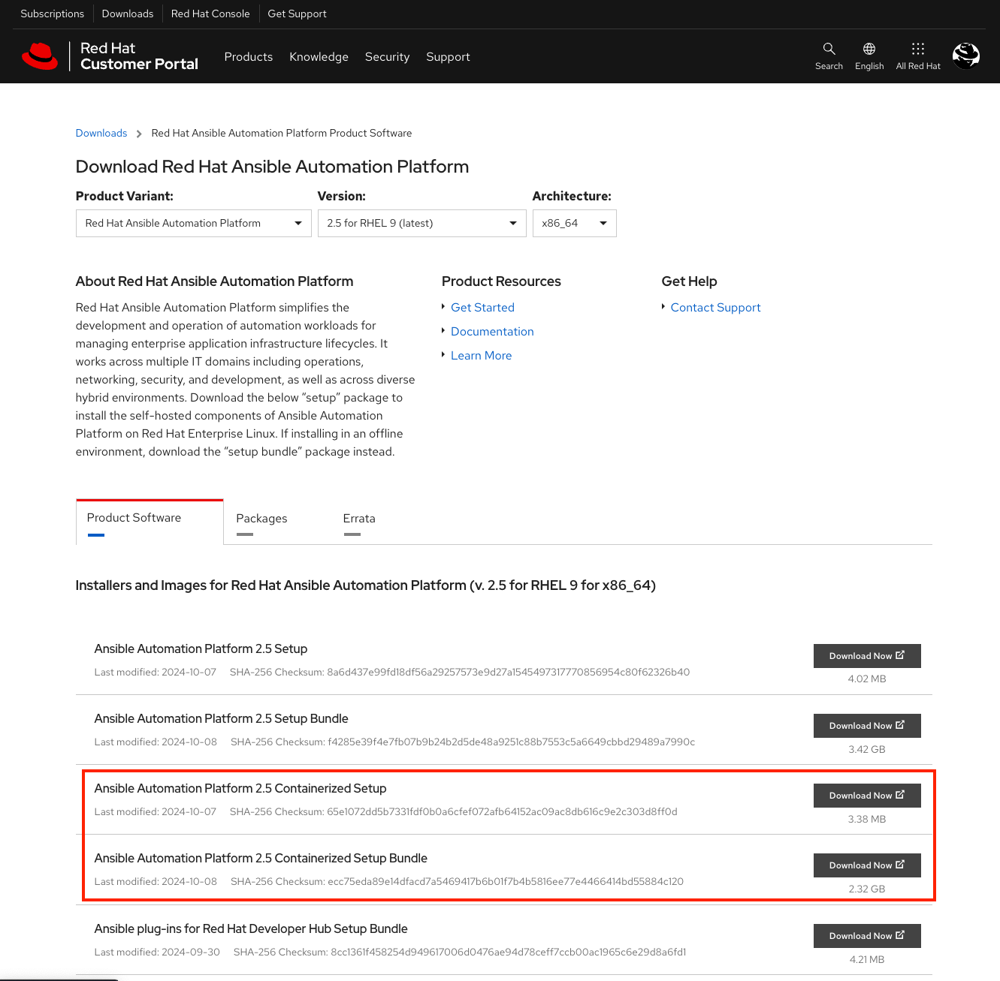

# 설치 준비

## 1. 사용자 구성

### 1.1 앤서블 사용자 추가 및 구성

```bash
useradd shadowman
passwd shadowman #(또는) echo '사용자_암호' | passwd --stdin shadowman 
grep shadowman /etc/passwd
grep shadowman /etc/group
```

실행 환경
```
[root@aap-c ~]# useradd shadowman

root@aap-c ~]# echo '사용자_암호' | passwd --stdin shadowman
Changing password for user shadowman.
passwd: all authentication tokens updated successfully.

[root@aap-c ~]# grep shadowman /etc/passwd
shadowman:x:1001:1001::/home/shadowman:/bin/bash

[root@aap-c ~]# grep shadowman /etc/group
shadowman:x:1001:

[root@aap-c ~]# 
```
<br>

### 1.2 앤서블 사용자의 sudo 구성

```bash
echo "shadowman ALL=(ALL)       NOPASSWD:ALL" > /etc/sudoers.d/shadowman
ls -lh /etc/sudoers.d/shadowman
su - shadowman
id
sudo -i
exit
exit
```

실행 환경
```
[root@aap-c ~]# echo "shadowman ALL=(ALL)       NOPASSWD:ALL" > /etc/sudoers.d/shadowman

[root@aap-c ~]# ls -lh /etc/sudoers.d/shadowman 
-rw-r--r--. 1 root root 30 Oct 14 10:40 /etc/sudoers.d/shadowman

[root@aap-c ~]# su - shadowman

[shadowman@aap-c ~]$ id
uid=1001(shadowman) gid=1001(shadowman) groups=1001(shadowman) context=unconfined_u:unconfined_r:unconfined_t:s0-s0:c0.c1023

[shadowman@aap-c ~]$ sudo -i

[root@aap-c ~]# exit
logout

[shadowman@aap-c ~]$ exit
logout

[root@aap-c ~]#
```
<br>
<br>

## 2. SSH 구성

### 2.1 앤서블 사용자의 SSH 키를 생성합니다.
```bash
su - shadowman
ssh-keygen -t rsa
ls -lh .ssh/
```

실행 환경
```
[root@aap-c ~]# su - shadowman

[shadowman@aap-c ~]$ ssh-keygen -t rsa
Generating public/private rsa key pair.
Enter file in which to save the key (/home/shadowman/.ssh/id_rsa): 
Created directory '/home/shadowman/.ssh'.
Enter passphrase (empty for no passphrase): 
Enter same passphrase again: 
Your identification has been saved in /home/shadowman/.ssh/id_rsa
Your public key has been saved in /home/shadowman/.ssh/id_rsa.pub
The key fingerprint is:
SHA256:wOaFaA0W04S9hvru+JRuaVtOS3JaF9EHXj2DvQ7nMVY shadowman@aap-c.thinkmore.net
The key's randomart image is:
+---[RSA 3072]----+
|    =*.   . .+   |
|   ..*o. o o. = E|
|    o.*.o o .  = |
|   ..ooo . .. *  |
|   . .. S    * o |
|  .  .   .    o  |
|   .+.* .        |
|   +=X o         |
|  .*B.o          |
+----[SHA256]-----+

[shadowman@aap-c ~]$ ls -lh .ssh/
total 8.0K
-rw-------. 1 shadowman shadowman 2.6K Oct 14 10:56 id_rsa
-rw-r--r--. 1 shadowman shadowman  583 Oct 14 10:56 id_rsa.pub

[shadowman@aap-c ~]$ 
```
<br>

### 2.2 SSH 키 복사

앤서블 사용자의 SSH 키를 설치할 호스트에 복사합니다.
```bash
ssh-copy-id aap-c.thinkmore.net
ssh aap-c.thinkmore.net
exit
ssh aap-c
exit
```

실행 결과
```
[shadowman@aap-c ~]$ ssh-copy-id aap-c.thinkmore.net
/usr/bin/ssh-copy-id: INFO: Source of key(s) to be installed: "/home/shadowman/.ssh/id_rsa.pub"
The authenticity of host 'aap-c.thinkmore.net (192.168.0.43)' can't be established.
ED25519 key fingerprint is SHA256:핑거_프린트.
This key is not known by any other names
Are you sure you want to continue connecting (yes/no/[fingerprint])? yes
/usr/bin/ssh-copy-id: INFO: attempting to log in with the new key(s), to filter out any that are already installed
/usr/bin/ssh-copy-id: INFO: 1 key(s) remain to be installed -- if you are prompted now it is to install the new keys
shadowman@aap-c.thinkmore.net's password: 

Number of key(s) added: 1

Now try logging into the machine, with:   "ssh 'aap-c.thinkmore.net'"
and check to make sure that only the key(s) you wanted were added.

[shadowman@aap-c ~]$ ssh aap-c.thinkmore.net
Register this system with Red Hat Insights: insights-client --register
Create an account or view all your systems at https://red.ht/insights-dashboard
Last login: Mon Oct 14 10:56:43 2024
[shadowman@aap-c ~]$ exit
logout
Connection to aap-c.thinkmore.net closed.

[shadowman@aap-c ~]$ ssh aap-c
The authenticity of host 'aap-c (192.168.0.43)' can't be established.
ED25519 key fingerprint is SHA256:핑거_프린트.
This host key is known by the following other names/addresses:
    ~/.ssh/known_hosts:1: aap-c.thinkmore.net
Are you sure you want to continue connecting (yes/no/[fingerprint])? yes
Warning: Permanently added 'aap-c' (ED25519) to the list of known hosts.
Register this system with Red Hat Insights: insights-client --register
Create an account or view all your systems at https://red.ht/insights-dashboard
Last login: Mon Oct 14 11:00:29 2024 from 192.168.0.43

[shadowman@aap-c ~]$ exit
logout
Connection to aap-c closed.

[shadowman@aap-c ~]$ 
```
<br>
<br>

## 3. 컨테이너화 된 AAP 다운로드
access.redhat.com에서 패키지 선택 후 다운로드
</img>

```bash

```

실행 환경
```

```
<br>
<br>

## 4. 컨테이너화 된 AAP 패키지 확인

```bash

```

실행 환경
```

```
<br>
<br>

## 5. 컨테이너화 된 AAP 설치 환경

```bash

```

실행 환경
```

```
<br>
<br>